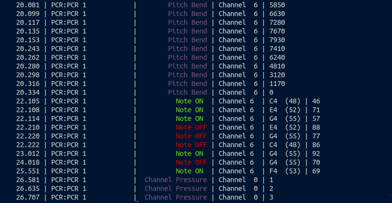

# Terminal ALSA MIDI Monitor

This CLI utility shows events that come from the alsa sequencer interface.

It is very useful to debug MIDI problems, ensure connectivity, and setup
of MIDI systems.

# Installation

```sh
cargo install terminal-midi-monitor
```

# Run

```
terminal-midi-monitor
```

Stop it with Control C.

# Screenshot



# Help welcome!

If you feel there is something missing, please open an Issue and help developing
Terminal MIDI Monitor. Every patch, help and suggestion is welcome.
